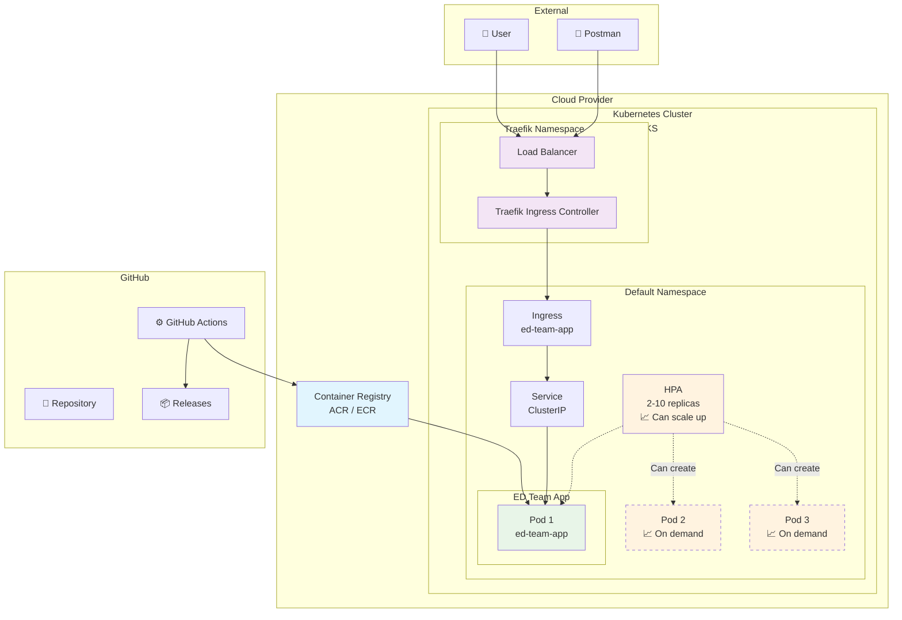
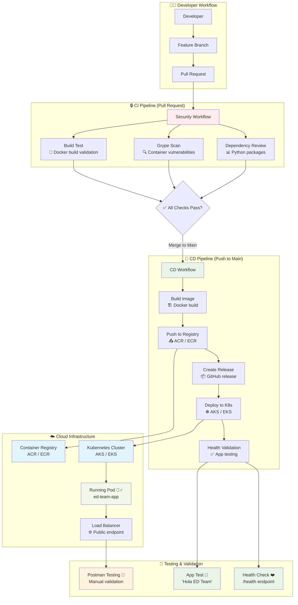
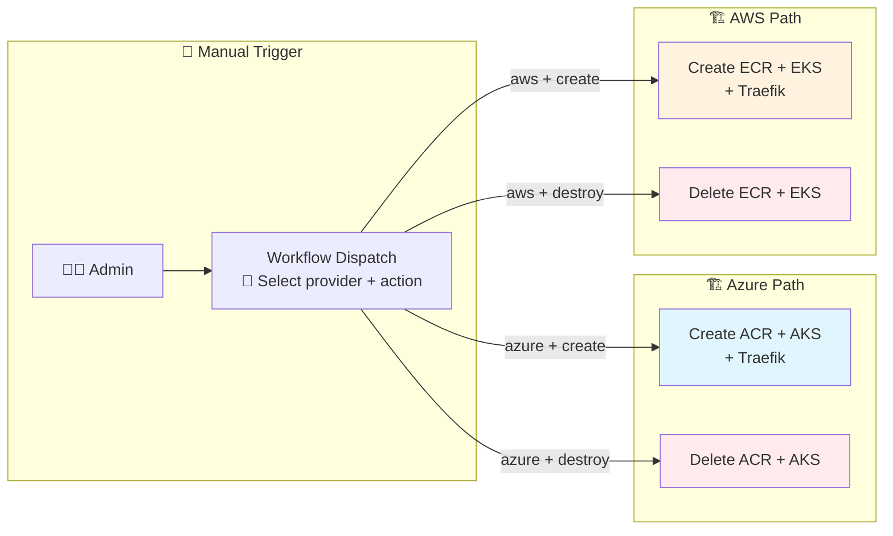

# Reto Técnico DevSecOps
Implementación completa de flujo DevSecOps para el reto técnico de ED Team. Incluye aplicación Flask, pipelines CI/CD automatizados, escaneo de seguridad y despliegue multi-cloud (Azure / AWS).

**Funcionalidad**: API que responde `{"message": "Hola ED Team"}` en el endpoint raíz.

## Arquitectura Multi-Cloud

| Componente | Azure | AWS |
|------------|-------|-----|
| **Container Registry** | ACR | ECR |
| **Kubernetes** | AKS | EKS |
| **Ingress** | Traefik | Traefik |
| **CI/CD** | GitHub Actions | GitHub Actions |
| **Security** | Dependency Review + Grype + CodeQL | Dependency Review + Grype + CodeQL |

# Diagramas

## Arquitectura de Infraestructura



## Flujo CI/CD Completo



## Workflow de Infraestructura (Manual)



## 📁 Estructura del Proyecto

```
├── .github/workflows/
│   ├── ci.yml              # Escaneo de seguridad en PRs
│   ├── cd.yml              # Pipeline de deployment (multi-cloud)
│   └── infraestructure.yml # Provisioning de infraestructura (Azure / AWS)
├── src/
│   ├── app.py              # Aplicación Flask
│   ├── requirements.txt    # Dependencias Python
│   └── Dockerfile          # Imagen de contenedor
├── k8s/
│   ├── deployment.yml      # Pods de la aplicación
│   ├── service.yml         # Servicio interno
│   ├── hpa.yml             # Auto-scaling
│   └── ingress.yml         # Acceso externo (Traefik)
└── README.md
```

## ⚙️ Setup e Instalación

### 1. **Configurar Secretos en GitHub**

Settings → Secrets → Actions:

**Para Azure:**
```
AZURE_CREDENTIALS = { "clientId": "...", "clientSecret": "...", "subscriptionId": "...", "tenantId": "..." }
```

**Para AWS:**
```
AWS_ACCESS_KEY_ID = tu-access-key
AWS_SECRET_ACCESS_KEY = tu-secret-key
```

### 2. **Configurar Variables en GitHub**

Settings → Variables → Actions:

| Variable | Azure | AWS |
|----------|-------|-----|
| `CLOUD_PROVIDER` | `azure` | `aws` |
| `RESOURCE_GROUP` | `mi-resource-group` | - |
| `AKS_NAME` | `mi-aks-cluster` | - |
| `CONTAINER_NAME` | `ed-team-app` | - |
| `REGISTRY_NAME` | `acredteamdevsecops` | - |
| `AZURE_LOCATION` | `eastus` | - |
| `AWS_REGION` | - | `us-east-1` |
| `EKS_CLUSTER_NAME` | - | `eks-ed-team-cluster` |
| `ECR_REPOSITORY_NAME` | - | `ed-team-app` |

### 3. **Crear Infraestructura**

1. Actions → **Provision Infrastructure**
2. Seleccionar **Cloud Provider**: `azure` o `aws`
3. Seleccionar **Action**: `create`
4. Run workflow

### 4. **Activar Branch Protection**

Settings → Rules → New Ruleset:
- Require pull request reviews (1)
- Restrict deletions
- Block force pushes

## Workflows

### **CI** (Pull Requests)
- **CodeQL SAST**: Análisis estático de seguridad
- **Dependency Review**: Vulnerabilidades en dependencias
- **Grype Scan**: Vulnerabilidades en contenedores

### **CD** (Push a main)
1. **Build**: Construye y sube imagen a ACR/ECR (segun `CLOUD_PROVIDER`)
2. **Release**: Crea GitHub release automatico
3. **Deploy**: Despliega a AKS/EKS con manifiestos K8s
4. **Validate**: Verifica health de la aplicación

### **Infrastructure** (Manual)
- Selector de **Cloud Provider**: Azure / AWS
- `create`: Provisiona registry + cluster + Traefik
- `destroy`: Elimina recursos

## Testing

### **Obtener endpoint externo**
```bash
kubectl get service -n traefik traefik
```

### **Test de la Aplicación**
```bash
# Main endpoint
GET http://[EXTERNAL-ADDR]/
Response: {"message": "Hola ED Team"}

# Health check
GET http://[EXTERNAL-ADDR]/health
Response: {"status": "healthy"}
```

## Seguridad Implementada

- ✅ **SAST** con CodeQL
- ✅ **Dependency scanning** en PRs
- ✅ **Container vulnerability scanning** con Grype
- ✅ **Non-root containers** con security contexts
- ✅ **Rulesets** con PR approvals
- ✅ **Resource limits** y security policies

## Manifiestos K8s (Cloud-agnostic)

- **deployment.yml**: 2 replicas con health checks, security contexts y zero-downtime deploys
- **service.yml**: ClusterIP para comunicación interna
- **hpa.yml**: Auto-scaling 2-10 pods basado en CPU/Memory
- **ingress.yml**: Traefik para acceso externo

## Comandos Útiles

### Azure
```bash
az aks get-credentials --resource-group [RG] --name [AKS_NAME]
kubectl get pods -l app=ed-team-app
kubectl get service -n traefik traefik
```

### AWS
```bash
aws eks update-kubeconfig --name [EKS_CLUSTER_NAME] --region [REGION]
kubectl get pods -l app=ed-team-app
kubectl get service -n traefik traefik
```

## ✅ Requisitos Cumplidos

### **Funcionales**
- [x] Aplicación "Hola ED Team"
- [x] Automatización con GitHub Actions
- [x] Trunk-based development
- [x] Recursos cloud automatizados (Azure + AWS)

### **Técnicos**
- [x] Multi-cloud: Azure (AKS + ACR) / AWS (EKS + ECR)
- [x] Traefik Ingress Controller
- [x] Build y push automatizado
- [x] Deploy con manifiestos K8s completos
- [x] Validación de pods y servicios
- [x] Rulesets con PR approvals
- [x] Escaneo de seguridad

## 🎯 Características Destacadas

- **Multi-Cloud**: Selector Azure / AWS en un solo workflow
- **GitOps**: Trunk-based development con PR obligatorios
- **Security**: Scanning automatizado en pipeline (SAST + SCA + Container)
- **HA**: 2 replicas minimas con auto-scaling hasta 10
- **Zero-Downtime**: RollingUpdate con maxUnavailable: 0
- **Monitoring**: Health checks y resource monitoring
- **Automation**: Infrastructure as Code completo
